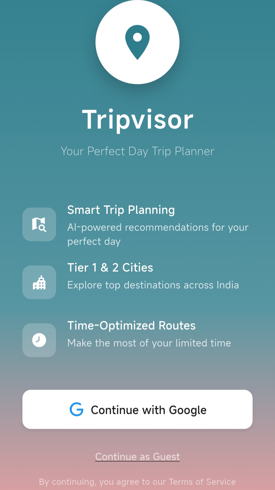
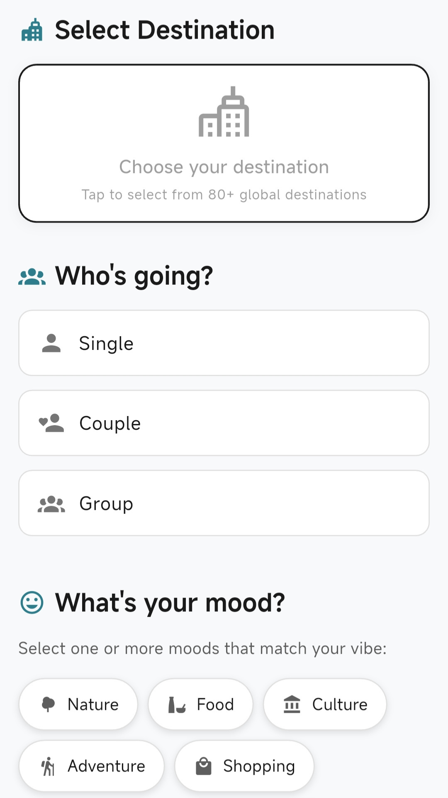
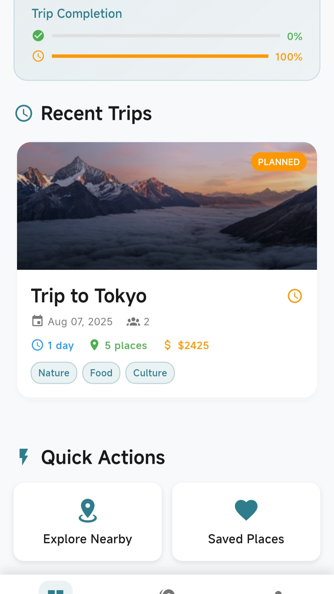
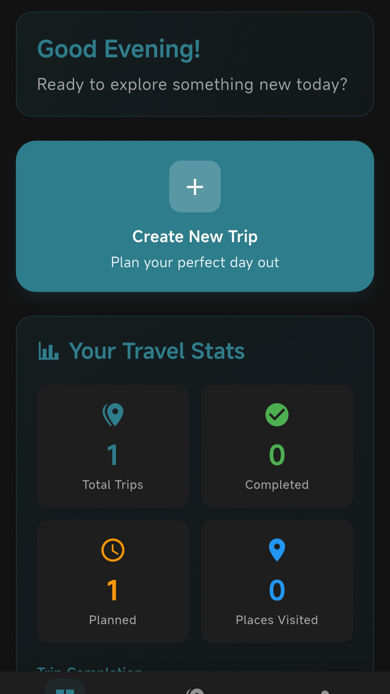
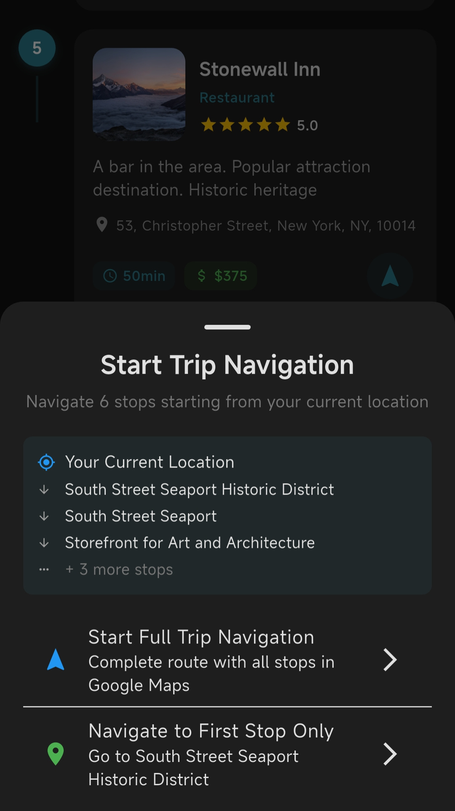

# 🌍 TripVisor – AI-Powered One-Day Trip Planner

TripVisor is an Android application built with **Flutter** that helps users generate personalized one-day trip itineraries in seconds.  
The app uses AI models, location data, and smart optimization to save travelers time, effort, and money.

---

## 🚀 Features
- AI-powered trip creation (5–10 seconds per itinerary).
- City selection and smart recommendations.
- Trip caching and recent trips.
- Saved places and favorites.
- Dashboard with personalized suggestions.
- Explore nearby attractions.
- Notifications for reminders and updates.
- Custom UI components for a smooth travel experience.

---

## 📂 Project Structure

Here’s an overview of the main components in the project:

### Core Utilities
- **api_provider** – Handles API calls to backend/AI services.  
- **api_settings_screen** – Screen to configure API settings and keys.  
- **constants** – Centralized app-wide constants.  
- **debug_logger** – Utility for logging and debugging.  
- **performance_optimizer** – Improves speed and reduces API costs.  
- **trip_cache_manager** – Caches trips for offline/quick access.  

### Theming & UI
- **app_theme** – Defines color schemes and global theming.  
- **theme_provider** – Dynamically switches light/dark themes.  
- **custom_chip** – Custom UI widget for tags and filters.  
- **loading_overlay** – Loading animation for smooth user experience.  
- **tripvisor_logo** – Branding and logo assets.  

### Navigation & Framework
- **frame_manager** – Manages app layout and screen containers.  
- **main_navigation** – Handles navigation between screens.  

### Screens
- **splash_screen** – App intro screen.  
- **landing_screen** – Welcome screen for new users.  
- **city_selection_screen** – Select city for trip generation.  
- **dashboard_screen** – Central hub with personalized recommendations.  
- **destinations_showcase_screen** – Highlights top attractions.  
- **explore_nearby_screen** – Explore nearby places and experiences.  
- **trip_creation_screen** – Input preferences and generate a trip.  
- **trip_result_screen** – Displays AI-generated itinerary.  
- **trip_detail_screen** – In-depth details of a trip.  
- **my_trips_screen** – View and manage past trips.  
- **saved_places_screen** – List of bookmarked places.  
- **notifications_screen** – Travel updates, reminders, and alerts.  
- **profile_screen** – User profile and settings.  

### screenshots

### Widgets
- **place_card** – Reusable card for displaying places.  
- **trip_card** – Compact summary of a trip.  
- **recent_trips_widget** – Carousel/list of recent trips.  
- **trip_stats_widget** – Insights and stats for trips.  

### Models & Data
- **enhanced_models** – Advanced AI-enhanced data models.  
- **trip_models** – Defines trip-related data structures.  
- **trip_provider** – State management for trips.  

---

## 🛠️ Tech Stack
- **Flutter & Dart** – Cross-platform UI framework.  
- **Java 17 + Gradle (KTS)** – Android build system.  
- **Firebase** – Hosting and authentication.  
- **AI APIs** – For itinerary generation and personalization.  

---
